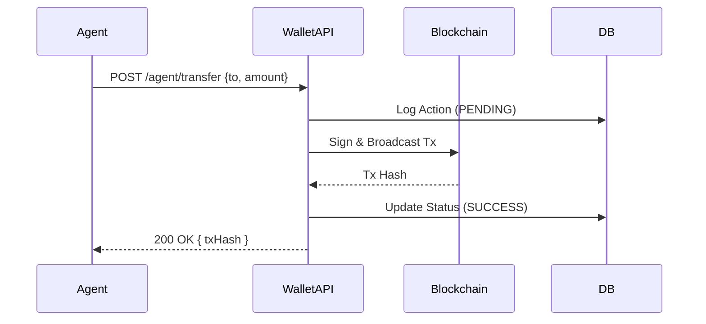

# Agent Interface Documentation

## Overview
This document defines the machine-readable interface for the Agent Wallet. It serves as the contract between the **Agent** (autonomous program) and the **Wallet** (signing and state service).

---

## 1. API
The Agent Wallet exposes a **RESTful API** over HTTP/1.1.

**Base URL:** `http://localhost:{port}` (Default: `3000`)
**Content-Type:** `application/json`

### Endpoints

#### `GET /agent/address`
Returns the active wallet's public EVM address.
*   **Response:**
    ```json
    { "address": "0x..." }
    ```

#### `GET /agent/balance`
Returns the current native asset (ETH) balance.
*   **Response:**
    ```json
    { "balance": "1.5", "currency": "ETH" }
    ```

#### `POST /agent/transfer`
Initiates a native token transfer.
*   **Request Body:**
    ```json
    {
      "to": "0xRecipientAddress...",
      "amount": "0.1"
    }
    ```
*   **Response:**
    ```json
    { "status": "success", "txHash": "0xHash..." }
    ```

#### `POST /agent/wrap`
Wraps native ETH into WETH (ERC-20).
*   **Request Body:**
    ```json
    { "amount": "0.5" }
    ```
*   **Response:**
    ```json
    { "status": "success", "txHash": "0xHash..." }
    ```

#### `POST /agent/unwrap`
Unwraps WETH back to native ETH.
*   **Request Body:**
    ```json
    { "amount": "0.5" }
    ```

---

## 2. Protocol
**Exchange Pattern:** Synchronous Request-Reply.

### Sequence Diagram


---

## 3. Data Schema
All data is serialized as JSON. Key types defined below using JSON Schema notation.

### Primitives
*   **EVMAddress:** `string` (Pattern: `^0x[a-fA-F0-9]{40}$`)
*   **Amount:** `string` (Decimal representation of ETH, e.g., "0.001")
*   **TxHash:** `string` (Pattern: `^0x[a-fA-F0-9]{64}$`)

### Validation Rules
1.  **Addresses:** Must check checksum if mixed-case, otherwise valid hex.
2.  **Amounts:** Must be non-negative strings to avoid floating-point errors.

---

## 4. Communication Bus
**Topology:** Local Hub-and-Spoke.
*   **Hub:** The Agent Wallet process (Express Server).
*   **Spoke:** The Agent process (running locally).

**Routing:**
*   **Direct:** HTTP paths route commands to specific handlers (`/transfer`, `/wrap`).

**Security:**
*   **Transport:** Plaintext HTTP (designed for localhost loopback only).
*   **Access:** Guarded by local process permissions.

---

## 5. State Management
The wallet implements a **Finite State Machine (FSM)** for transaction lifecycles, persisted in a local SQLite database.

### Transaction FSM
1.  **PENDING:** Request received, validated, and logged.
2.  **SUBMITTED:** Transaction signed and broadcast to mempool.
3.  **SUCCESS:** RPC confirmation received (or Hash returned).
4.  **FAILED:** RPC error, rejection, or simulation failure.

### Persistence
*   **Store:** SQLite (`agent_wallet.db`)
*   **Table:** `audit_log`
*   **Retention:** Permanent (until manual prune).

---

## 6. Event Stream
Currently implemented as a **Polled Log**. Agents can query the internal state via the `audit` CLI command or future API endpoints.

### Event Types
| Event Type | Description | Payload Data |
| :--- | :--- | :--- |
| `WALLET_SETUP` | Wallet initialization | `mode` (Generate/Import) |
| `TRANSFER` | Native asset send | `to`, `amount`, `from` |
| `WRAP_ETH` | WETH Deposit | `amount` |
| `UNWRAP_ETH` | WETH Withdrawal | `amount` |
| `TRANSFER_ERROR` | Failed operation | `error` (string) |

---

## 7. Command Set
Abstract commands mapped to API operations.

| Verb | Object | Parameters | API Mapping |
| :--- | :--- | :--- | :--- |
| `GET` | `IDENTITY` | `None` | `GET /agent/address` |
| `GET` | `ASSET_BALANCE` | `asset: "ETH"` | `GET /agent/balance` |
| `SEND` | `NATIVE_TOKEN` | `recipient: EVMAddress`, `amount: Amount` | `POST /agent/transfer` |
| `SWAP` | `ETH_TO_WETH` | `amount: Amount` | `POST /agent/wrap` |
| `SWAP` | `WETH_TO_ETH` | `amount: Amount` | `POST /agent/unwrap` |
